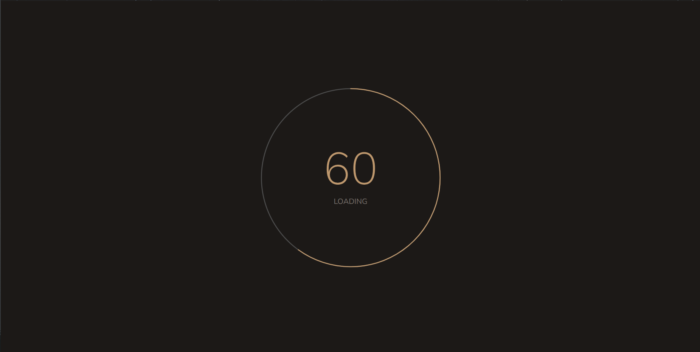
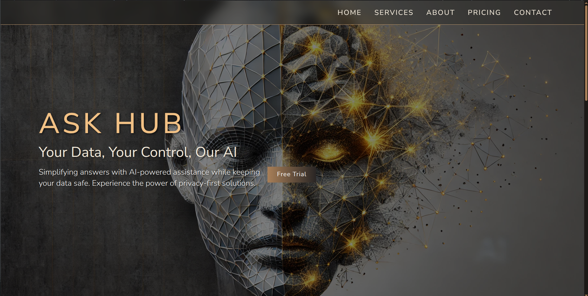
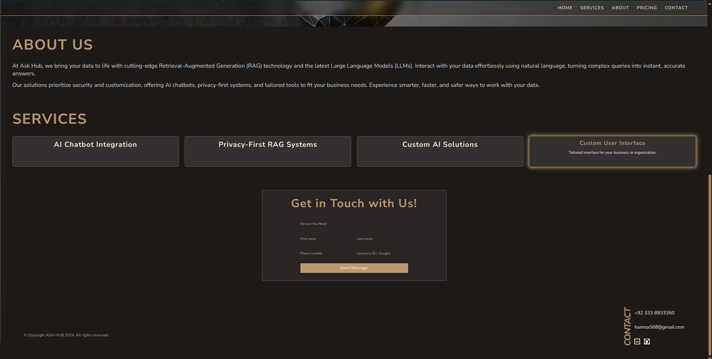
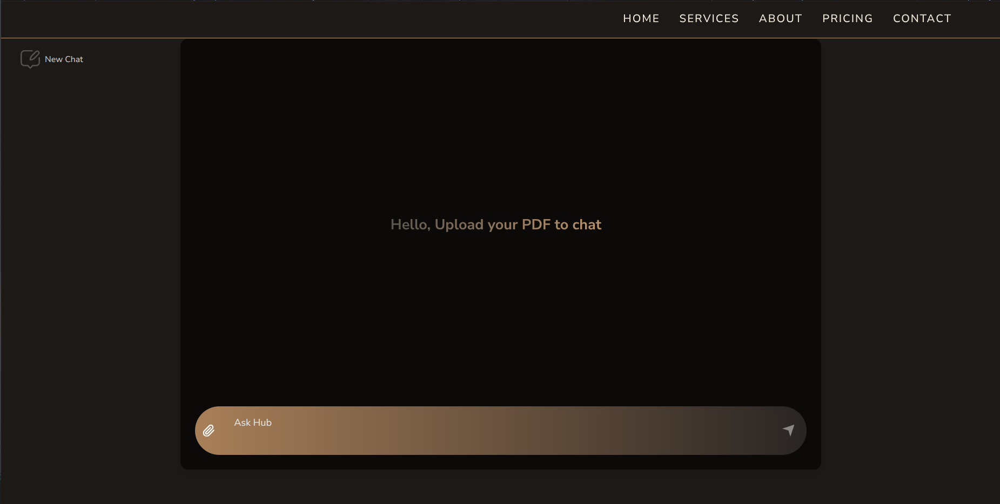

# Ask-Hub
Your Data, Your Control, Our AI.

---

## Project Screenshots

### Load Screen


### Home Screen


### Others Screen


### Chatbot Screen


---

## How to Run the Project

### 1. Backend (FastAPI)

- Navigate to the backend directory:
  ```bash
  cd backend
  ```
- (Optional but recommended) Create and activate a virtual environment:
  ```bash
  python3 -m venv venv
  source venv/bin/activate
  ```
- Install dependencies:
  ```bash
  pip install -r requirements.txt
  ```
- Start the FastAPI server:
  ```bash
  uvicorn main:app --reload
  ```
  The backend will run by default on [http://127.0.0.1:8000](http://127.0.0.1:8000)

### 2. Frontend (React + Vite)

- Open a new terminal and navigate to the frontend directory:
  ```bash
  cd frontend
  ```
- Install dependencies:
  ```bash
  npm install
  ```
- Start the development server:
  ```bash
  npm run dev
  ```
  The frontend will run by default on [http://localhost:5173](http://localhost:5173)

---

## Notes
- Make sure both backend and frontend servers are running for full functionality.
- You may need to adjust API URLs in the frontend if you change backend ports or run on a different host.
